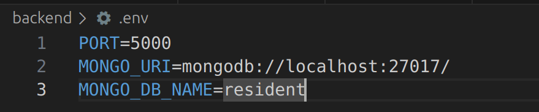

# ResidentManagement
Introduction to SE project
* backend
    npm run dev
* *frontend
    npm run dev

### connect database
* vào terminal chuyển đến thư mục backend gõ lệnh sau để tải thư viện
   * npm i mongoose

* Tải mongoDB copy connection string, tạo file .env trong backend, thêm các biến môi trường MONGO_URI, MONGO_DB_NAME

